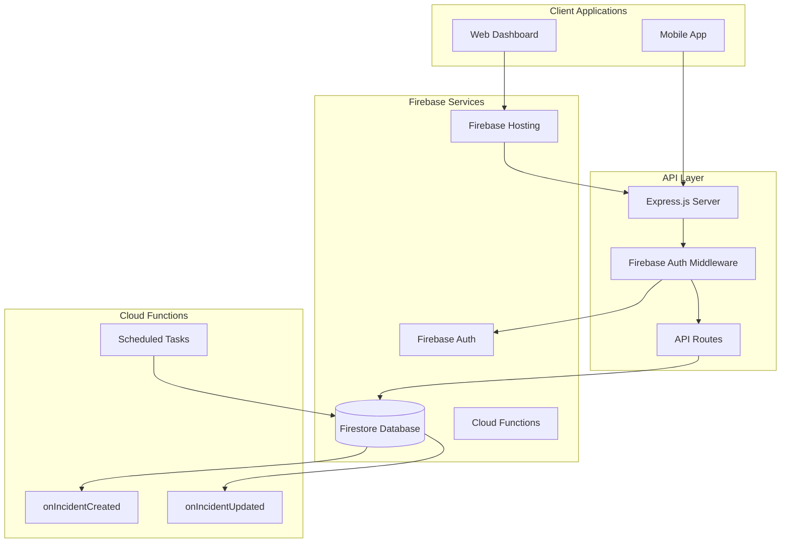
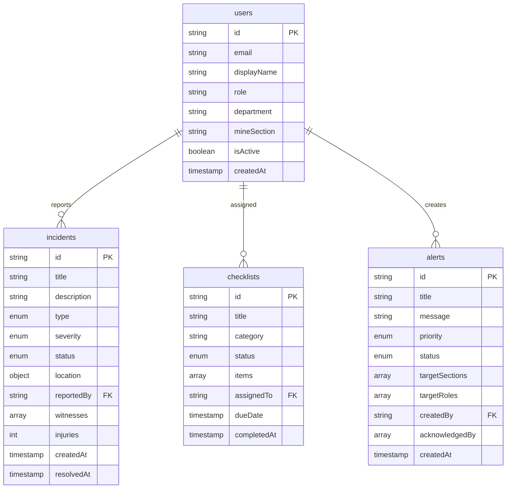
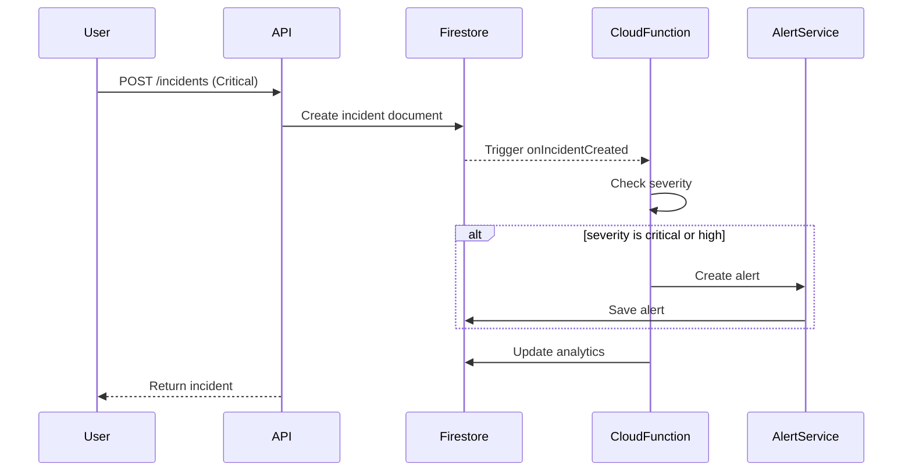
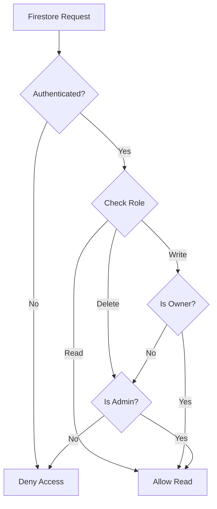

# EIO3 Firebase - Architecture Documentation

## CSIR EOI 8119 - Mining Safety Dashboard

### System Architecture

### Firestore Data Model

### Cloud Functions Flow

### Component Architecture

```mermaid
flowchart LR
    subgraph backend [Backend Services]
        Server[Express Server]
        AuthMW[Auth Middleware]

        subgraph routes [Routes]
            AuthR[Auth Routes]
            IncidentR[Incident Routes]
            ChecklistR[Checklist Routes]
            AlertR[Alert Routes]
            AnalyticsR[Analytics Routes]
        end

        subgraph services [Services]
            IncidentS[Incident Service]
            ChecklistS[Checklist Service]
            AlertS[Alert Service]
        end
    end

    subgraph frontend [Frontend Dashboard]
        HTML[HTML5]
        CSS[CSS3]
        JS[JavaScript]
    end

    subgraph firebase [Firebase]
        Firestore[(Firestore)]
        Functions[Cloud Functions]
    end

    Server --> AuthMW
    AuthMW --> routes
    routes --> services
    services --> Firestore

    HTML --> JS
    JS --> Server

    Firestore --> Functions
```

### Scheduled Functions

```mermaid
gantt
    title Daily Cloud Functions Schedule
    dateFormat HH:mm

    section Reports
    Daily Report Generation    :06:00, 30m
    Weekly Summary             :08:00, 30m

    section Monitoring
    Check Overdue Checklists   :active, 00:00, 24h

    section Maintenance
    Cleanup Old Records        :00:00, 30m
```

### Security Rules Flow

